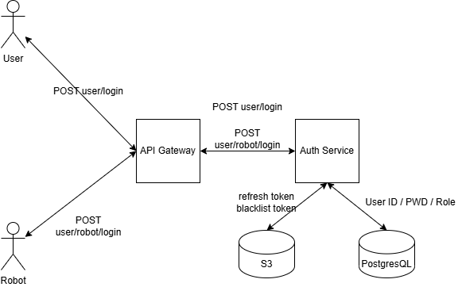

# AuthService-For-MSA

## Auth Service API
This service is for JWT based authorizing using Django REST Framework.
This service provides sign up, sign in, token update, sign out.

## Tech Stack
- Python 3.12
- Django 5.1
- Django REST Framework
- SimpleJWT
- PostgreSQL (또는 SQLite)

## Senario UML



## Installation

```bash
# 1. Clone the repository
git clone https://github.com/username/auth-service.git
cd auth-service

# 2. Create a virtual environment
python3 -m venv venv
source venv/bin/activate

# 3. Install dependencies
pip install -r requirements.txt

# 4. Run migrations
python manage.py migrate

# 5. Start the server
python manage.py runserver
```

##  API 사용법 (Usage / API Endpoints)
- 주요 엔드포인트와 요청/응답 예시를 간단히 작성  

```markdown
## API Endpoints

| Method | Endpoint               | Description      |
|--------|------------------------|------------------|
| POST   | /api/auth/register/    | 회원가입          |
| POST   | /api/auth/login/       | 로그인 및 토큰 발급 |
| POST   | /api/auth/refresh/     | 토큰 갱신         |
| POST   | /api/auth/logout/      | 로그아웃          |
```

### Example Request (Register)
```bash
POST /api/auth/register/
{
  "username": "user1",
  "password": "1234"
}
```


## 🧩 프로젝트 구조 (Project Structure)
```markdown
## Project Structure
auth_service/
├── accounts/
│   ├── views.py
│   ├── serializers.py
│   ├── urls.py
│   └── models.py
├── auth_service/
│   ├── settings.py
│   ├── urls.py
│   └── wsgi.py
└── manage.py
```

## Testing
```bash
python manage.py test


```

## 📜 라이선스 (License)
```markdown
## License
This project is licensed under the GNU General Public License v3.0 (GPLv3).
See the [LICENSE](./LICENSE) file for details.
```